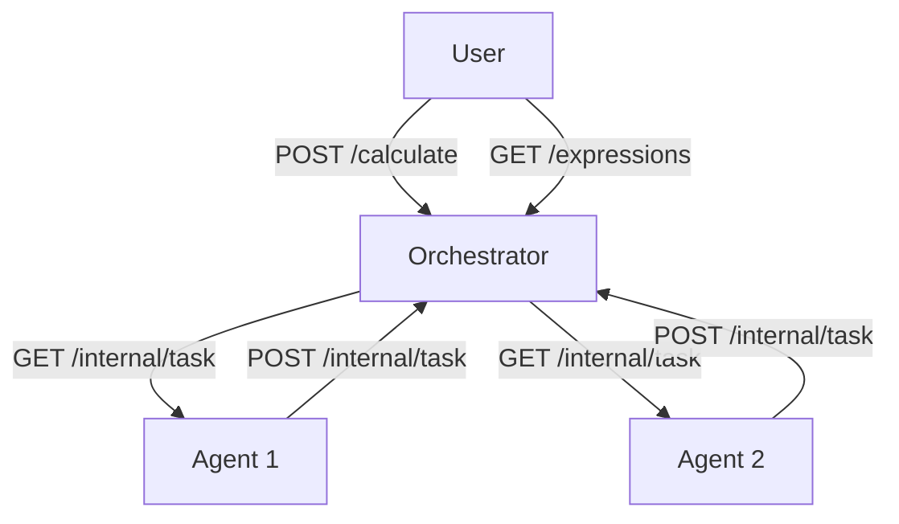

# Distributed Arithmetic Expression Calculator

A system for parallel computation of complex arithmetic expressions using an orchestrator and compute agents.

## Installation

 1. **Clone the repository**:
    ```bash
    git clone https://github.com/MKode312/calculator_go.git
    cd calculator_go
    ```

---

## Architecture



**Orchestrator** (default port 8080):

- Accepts expressions via REST API
- Breaks down expressions into atomic tasks
- Manages the task queue
- Collects results
- Stores computation statuses

**Agents**:

- Receive tasks via HTTP requests
- Perform arithmetic operations with delays
- Return results through the API

## Requirements

- Go 1.20+
- Supported operations: +, -, \*, /
- Operator precedence and parentheses
- Parallel execution of operations

# Running the System

## 1. Starting the Orchestrator

### Linux / macOS (bash)
~~~bash
# Setting operation times (in milliseconds)
export TIME_ADDITION_MS=200
export TIME_SUBTRACTION_MS=200
export TIME_MULTIPLICATIONS_MS=300
export TIME_DIVISIONS_MS=400

# Start the orchestrator
go run ./cmd/orchestrator/main.go
~~~

### Windows (cmd.exe)
~~~bat
:: Setting operation times (in milliseconds)
set TIME_ADDITION_MS=200
set TIME_SUBTRACTION_MS=200
set TIME_MULTIPLICATIONS_MS=300
set TIME_DIVISIONS_MS=400

:: Start the orchestrator
go run .\cmd\orchestrator\main.go
~~~

### Windows (PowerShell)
~~~powershell
# Setting operation times (in milliseconds)
$env:TIME_ADDITION_MS = "200"
$env:TIME_SUBTRACTION_MS = "200"
$env:TIME_MULTIPLICATIONS_MS = "300"
$env:TIME_DIVISIONS_MS = "400"

# Start the orchestrator
go run .\cmd\orchestrator\main.go
~~~

## 2. Starting the Agent

### Linux / macOS (bash)
~~~bash
# Specify computing power (number of goroutines) and orchestrator URL
export COMPUTING_POWER=4
export ORCHESTRATOR_URL=http://localhost:8080

# Start the agent
go run ./cmd/agent/main.go
~~~

### Windows (cmd.exe)
~~~bat
:: Specify computing power (number of goroutines) and orchestrator URL
set COMPUTING_POWER=4
set ORCHESTRATOR_URL=http://localhost:8080

:: Start the agent
go run .\cmd\agent\main.go
~~~

### Windows (PowerShell)
~~~powershell
# Specify computing power (number of goroutines) and orchestrator URL
$env:COMPUTING_POWER = "4"
$env:ORCHESTRATOR_URL = "http://localhost:8080"

# Start the agent
go run .\cmd\agent\main.go
~~~

## API Endpoints

### 1. Adding an Expression

```bash
POST /api/v1/calculate
```

Example request:

```bash
curl --location 'http://localhost:8080/api/v1/calculate' \
--header 'Content-Type: application/json' \
--data '{
  "expression": "(10-5)*3-10/2"
}'
```
Successful response (201):

```json
{
    "id": "1"
}
```

### 2. Getting a List of Expressions

```bash
GET /api/v1/expressions
```

Example response (200):

```json
{
    "expressions": [
        {
            "id": "1",
            "expression": "(10-5)*3-10/2",
            "status": "completed",
            "result": 10
        },
        {
            "id": "2",
            "expression": "7/(5-5)",
            "status": "error",
        }
    ]
}
```

### 3. Getting an Expression by ID

```bash
GET /api/v1/expressions/{id}
```

Example request:

```bash
curl http://localhost:8080/api/v1/expressions/1
```

Response (200):

```json
{
    "expression": {
        "id": "1",
        "expression": "(10-5)*3-10/2",
        "status": "completed",
        "result": 10
    }
}
```

## Internal API (for agents)

### 1. Getting a Task

```bash
GET /internal/task
```

Example response (200):

```json
{
    "task": {
        "id": "7",
        "arg1": 3,
        "arg2": 4,
        "operation": "+",
        "operation_time": 200
    }
}
```

### 2. Sending the Result

```bash
POST /internal/task
```

Example request:

```json
{
  "id": "7",
  "result": 7
}
```

## Environment Variables

### Orchestrator

- `PORT` - server port (default 8080)
- `TIME_ADDITION_MS` - addition time (ms)
- `TIME_SUBTRACTION_MS` - subtraction time (ms)
- `TIME_MULTIPLICATIONS_MS` - multiplication time (ms)
- `TIME_DIVISIONS_MS` - division time (ms)

### Agent

- `ORCHESTRATOR_URL` - URL of the orchestrator
- `COMPUTING_POWER` - number of parallel tasks

## Scenario Examples

### Scenario 1: Successful Calculation

```bash
# Sending an expression
curl --location 'http://localhost:8080/api/v1/calculate' \
--data '{"expression": "2+2*2"}'

# Checking the status
curl http://localhost:8080/api/v1/expressions/1

# Response after 500 ms:
{
    "expression": {
        "id": "1",
        "expression": "2+2*2",
        "status": "completed",
        "result": 6
    }
}
```

### Scenario 2: Division by Zero Error

```bash
curl --location 'http://localhost:8080/api/v1/calculate' \
--data '{"expression": "12/(9-9)"}'

# Checking the status
curl http://localhost:8080/api/v1/expressions/2

# Response:
{
    "expression": {
        "id": "2",
        "expression": "12/(9-9)",
        "status": "error",
    }
}
```

### Testing

```bash
go test .\tests\
```
